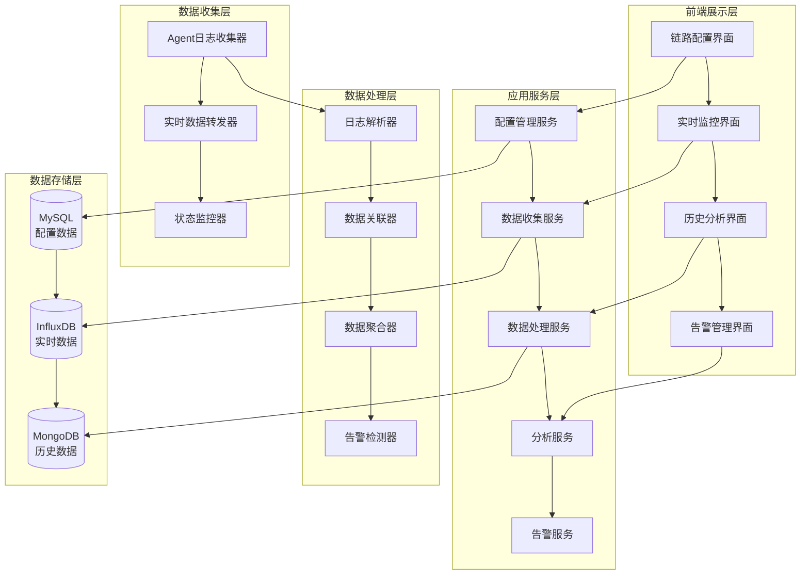

# 压测链路延时数据收集功能设计文档

## 0. 版本信息与Git记录

### 0.1 当前版本
- **版本号**: v1.0.0
- **创建时间**: 2024-11-13
- **Git提交**: `b988c17` - update: 更新本地代码配置

### 0.2 Git提交记录
```bash
commit b988c17update: 更新本地代码配置
Author: Assistant <noreply@anthropic.com>
Date: Thu Nov 13 16:35:19 2024 +0000

主要变更:
- 简化 GroupLevelEnum，移除 UNKNOWN 枚举值
- 更新前端 Vue 配置
- 同步本地开发配置到仓库
- 修复 CORS 配置错误：将 allowedOrigins("*") 改为 allowedOriginPatterns("*")

注意: GroupLevelEnum 仍为 Integer 类型，数据库中 'OFF' 字符串值需要后续处理
```

### 0.3 基准说明
此版本作为链路延时数据收集功能开发的基准版本，包含：
- 完整的需求分析和设计方案
- 现有系统的配置和架构
- CORS 跨域问题已修复
- SocketIO 连接配置待验证

## 1. 系统架构设计

### 1.1 整体架构



### 1.2 技术栈选择

| 层次 | 技术选择 | 说明 |
|------|----------|------|
| **前端** | Vue.js 2.x + Element UI + ECharts | 现有技术栈，无缝集成 |
| **后端** | Spring Boot 2.3 + MyBatis-Plus | 现有技术栈，保持一致性 |
| **实时通信** | SocketIO + WebSocket | 支持实时数据推送 |
| **日志解析** | AWK + 正则表达式 | 高效的文本处理能力 |
| **数据存储** | MySQL + InfluxDB + MongoDB | 多数据库组合，发挥各自优势 |
| **容器化** | Docker + Docker Compose | 支持快速部署和扩展 |

## 2. 数据模型设计

### 2.1 MySQL 数据模型

#### 2.1.1 链路配置表 (chain_trace_config)
```sql
CREATE TABLE chain_trace_config (
    id BIGINT PRIMARY KEY AUTO_INCREMENT COMMENT '主键ID',
    chain_name VARCHAR(100) NOT NULL COMMENT '链路名称',
    description TEXT COMMENT '链路描述',
    task_id VARCHAR(50) COMMENT '关联测试任务ID',
    status TINYINT DEFAULT 1 COMMENT '状态：1-启用，0-禁用',
    created_by VARCHAR(50) COMMENT '创建人',
    created_time DATETIME DEFAULT CURRENT_TIMESTAMP COMMENT '创建时间',
    updated_by VARCHAR(50) COMMENT '更新人',
    updated_time DATETIME DEFAULT CURRENT_TIMESTAMP ON UPDATE CURRENT_TIMESTAMP COMMENT '更新时间',
    delete_time DATETIME COMMENT '删除时间',
    INDEX idx_task_id (task_id),
    INDEX idx_chain_name (chain_name),
    INDEX idx_status (status)
) ENGINE=InnoDB DEFAULT CHARSET=utf8mb4 COMMENT='链路追踪配置表';
```

#### 2.1.2 链路节点配置表 (chain_node_config)
```sql
CREATE TABLE chain_node_config (
    id BIGINT PRIMARY KEY AUTO_INCREMENT COMMENT '主键ID',
    chain_id BIGINT NOT NULL COMMENT '所属链路ID',
    node_name VARCHAR(50) NOT NULL COMMENT '节点名称',
    node_type VARCHAR(20) DEFAULT 'APPLICATION' COMMENT '节点类型：APPLICATION-应用，DATABASE-数据库，CACHE-缓存等',
    node_description VARCHAR(200) COMMENT '节点描述',
    sequence_order INT DEFAULT 1 COMMENT '执行顺序',
    log_path TEXT COMMENT '日志文件路径',
    log_pattern TEXT COMMENT '日志匹配模式',
    timestamp_pattern TEXT COMMENT '时间戳提取模式',
    latency_pattern TEXT COMMENT '延时提取模式',
    request_id_pattern TEXT COMMENT '请求ID提取模式',
    data_mapping JSON COMMENT '数据映射配置',
    status TINYINT DEFAULT 1 COMMENT '状态：1-启用，0-禁用',
    created_time DATETIME DEFAULT CURRENT_TIMESTAMP COMMENT '创建时间',
    updated_time DATETIME DEFAULT CURRENT_TIMESTAMP ON UPDATE CURRENT_TIMESTAMP COMMENT '更新时间',
    delete_time DATETIME COMMENT '删除时间',
    FOREIGN KEY (chain_id) REFERENCES chain_trace_config(id) ON DELETE CASCADE,
    INDEX idx_chain_id (chain_id),
    INDEX idx_node_name (node_name),
    INDEX idx_sequence_order (sequence_order)
) ENGINE=InnoDB DEFAULT CHARSET=utf8mb4 COMMENT='链路节点配置表';
```

#### 2.1.3 告警规则配置表 (chain_alert_rule)
```sql
CREATE TABLE chain_alert_rule (
    id BIGINT PRIMARY KEY AUTO_INCREMENT COMMENT '主键ID',
    chain_id BIGINT COMMENT '关联链路ID',
    node_id BIGINT COMMENT '关联节点ID',
    rule_name VARCHAR(100) NOT NULL COMMENT '规则名称',
    rule_type VARCHAR(20) NOT NULL COMMENT '规则类型：LATENCY-延时，ERROR_RATE-错误率，AVAILABILITY-可用性',
    threshold_value DECIMAL(10,2) COMMENT '阈值',
    comparison_operator VARCHAR(10) COMMENT '比较操作符：GT-大于，LT-小于，EQ-等于',
    time_window INT COMMENT '时间窗口（秒）',
    alert_level VARCHAR(20) DEFAULT 'WARNING' COMMENT '告警级别：INFO，WARNING，ERROR，CRITICAL',
    notification_config JSON COMMENT '通知配置',
    status TINYINT DEFAULT 1 COMMENT '状态：1-启用，0-禁用',
    created_time DATETIME DEFAULT CURRENT_TIMESTAMP COMMENT '创建时间',
    updated_time DATETIME DEFAULT CURRENT_TIMESTAMP ON UPDATE CURRENT_TIMESTAMP COMMENT '更新时间',
    FOREIGN KEY (chain_id) REFERENCES chain_trace_config(id) ON DELETE CASCADE,
    FOREIGN KEY (node_id) REFERENCES chain_node_config(id) ON DELETE CASCADE,
    INDEX idx_chain_id (chain_id),
    INDEX idx_node_id (node_id),
    INDEX idx_rule_type (rule_type)
) ENGINE=InnoDB DEFAULT CHARSET=utf8mb4 COMMENT='链路告警规则配置表';
```

### 2.2 InfluxDB 数据模型

#### 2.2.1 链路延时数据 (chain_latency)
```
Measurement: chain_latency
Tags:
  - task_id: string          # 测试任务ID
  - chain_name: string       # 链路名称
  - node_name: string        # 节点名称
  - node_type: string        # 节点类型
  - request_id: string       # 请求ID（可选）
  - status: string           # 状态：SUCCESS，ERROR，TIMEOUT
Fields:
  - latency: float           # 延时时间（毫秒）
  - cpu_usage: float         # CPU使用率（可选）
  - memory_usage: float      # 内存使用率（可选）
  - error_count: integer     # 错误次数（可选）
  - success_count: integer   # 成功次数（可选）
Time: 2023-XX-XX XX:XX:XXZ   # 时间戳
```

#### 2.2.2 链路汇总数据 (chain_summary)
```
Measurement: chain_summary
Tags:
  - task_id: string          # 测试任务ID
  - chain_name: string       # 链路名称
  - aggregation_level: string # 聚合级别：NODE，CHAIN，GLOBAL
Fields:
  - total_requests: integer  # 总请求数
  - successful_requests: integer # 成功请求数
  - failed_requests: integer # 失败请求数
  - avg_latency: float       # 平均延时
  - max_latency: float       # 最大延时
  - min_latency: float       # 最小延时
  - p50_latency: float       # 50%分位数
  - p95_latency: float       # 95%分位数
  - p99_latency: float       # 99%分位数
  - error_rate: float        # 错误率
  - throughput: float        # 吞吐量（TPS）
Time: 2023-XX-XX XX:XX:XXZ   # 时间戳
```

### 2.3 MongoDB 数据模型

#### 2.3.1 链路追踪详情 (chain_trace_detail)
```json
{
  "_id": ObjectId,
  "task_id": "task_12345",
  "request_id": "req_abcde",
  "chain_name": "订单处理链路",
  "trace_data": [
    {
      "node_name": "订单接收",
      "node_type": "APPLICATION",
      "timestamp": ISODate("2023-XX-XXT10:00:00.000Z"),
      "latency": 15.5,
      "status": "SUCCESS",
      "sequence": 1,
      "metadata": {
        "thread_name": "pool-1-thread-1",
        "host": "server-01"
      }
    },
    {
      "node_name": "库存检查",
      "node_type": "DATABASE",
      "timestamp": ISODate("2023-XX-XXT10:00:00.015Z"),
      "latency": 25.3,
      "status": "SUCCESS",
      "sequence": 2,
      "metadata": {
        "query_time": 20.1,
        "connection_pool": "order-db"
      }
    }
  ],
  "total_latency": 65.8,
  "start_time": ISODate("2023-XX-XXT10:00:00.000Z"),
  "end_time": ISODate("2023-XX-XXT10:00:00.065Z"),
  "status": "SUCCESS",
  "created_time": ISODate("2023-XX-XXT10:00:01.000Z"),
  "metadata": {
    "user_id": "user_123",
    "order_id": "order_456"
  }
}
```

#### 2.3.2 链路性能快照 (chain_performance_snapshot)
```json
{
  "_id": ObjectId,
  "task_id": "task_12345",
  "chain_name": "订单处理链路",
  "snapshot_time": ISODate("2023-XX-XXT10:00:00.000Z"),
  "node_snapshots": [
    {
      "node_name": "订单接收",
      "latency_stats": {
        "min": 5.2,
        "max": 45.8,
        "avg": 15.6,
        "p50": 14.3,
        "p95": 28.7,
        "p99": 38.2
      },
      "request_count": 1250,
      "error_count": 12,
      "throughput": 45.6
    }
  ],
  "chain_stats": {
    "total_requests": 1250,
    "successful_requests": 1238,
    "failed_requests": 12,
    "avg_latency": 65.8,
    "max_latency": 145.3,
    "min_latency": 12.1
  },
  "created_time": ISODate("2023-XX-XXT10:01:00.000Z")
}
```

## 3. 核心组件设计

### 3.1 配置管理服务 (ConfigManagementService)

```java
@Service
@Transactional
public class ConfigManagementService {

    @Autowired
    private ChainTraceConfigMapper chainConfigMapper;

    @Autowired
    private ChainNodeConfigMapper nodeConfigMapper;

    /**
     * 创建链路配置
     */
    public ChainTraceConfigDO createChain(ChainConfigDTO dto) {
        // 1. 验证链路名称唯一性
        validateChainName(dto.getChainName());

        // 2. 创建链路配置
        ChainTraceConfigDO config = new ChainTraceConfigDO();
        BeanUtils.copyProperties(dto, config);
        config.setCreatedBy(getCurrentUser());
        chainConfigMapper.insert(config);

        // 3. 创建默认节点
        createDefaultNodes(config.getId(), dto.getNodeConfigs());

        // 4. 通知Agent更新配置
        notifyAgentConfigUpdate(config);

        return config;
    }

    /**
     * 添加链路节点
     */
    public ChainNodeConfigDO addNode(Long chainId, NodeConfigDTO dto) {
        // 1. 验证链路存在
        ChainTraceConfigDO chain = validateChainExist(chainId);

        // 2. 验证节点名称唯一性
        validateNodeName(chainId, dto.getNodeName());

        // 3. 创建节点配置
        ChainNodeConfigDO node = new ChainNodeConfigDO();
        BeanUtils.copyProperties(dto, node);
        node.setChainId(chainId);
        node.setSequenceOrder(getNextSequenceOrder(chainId));
        nodeConfigMapper.insert(node);

        // 4. 更新节点配置到Agent
        updateNodeConfigToAgent(node);

        return node;
    }

    /**
     * 更新节点解析规则
     */
    public void updateNodeParsingRule(Long nodeId, ParsingRuleDTO dto) {
        ChainNodeConfigDO node = nodeConfigMapper.selectById(nodeId);
        if (node == null) {
            throw new BusinessException("节点不存在");
        }

        // 1. 更新解析规则
        node.setLogPattern(dto.getLogPattern());
        node.setTimestampPattern(dto.getTimestampPattern());
        node.setLatencyPattern(dto.getLatencyPattern());
        node.setRequestIdPattern(dto.getRequestIdPattern());
        nodeConfigMapper.updateById(node);

        // 2. 重新生成AWK脚本
        generateAwkScript(node);

        // 3. 推送新配置到Agent
        pushNodeConfigToAgent(node);
    }
}
```

### 3.2 数据收集服务 (DataCollectionService)

```java
@Service
public class DataCollectionService {

    @Autowired
    private InfluxDBTemplate influxDBTemplate;

    @Autowired
    private MongoTemplate mongoTemplate;

    @Autowired
    private SocketIOServer socketIOServer;

    /**
     * 处理Agent上报的链路数据
     */
    public void processChainData(ChainDataDTO dto) {
        // 1. 数据校验
        validateChainData(dto);

        // 2. 解析原始日志
        List<ChainLatencyData> latencyData = parseRawLogs(dto);

        // 3. 关联请求数据
        List<ChainTraceData> traceData = correlateRequests(latencyData);

        // 4. 存储到InfluxDB
        storeToInfluxDB(latencyData);

        // 5. 存储到MongoDB
        storeToMongoDB(traceData);

        // 6. 实时推送
        pushRealTimeData(traceData);

        // 7. 检查告警规则
        checkAlertRules(traceData);
    }

    /**
     * 解析原始日志
     */
    private List<ChainLatencyData> parseRawLogs(ChainDataDTO dto) {
        List<ChainLatencyData> results = new ArrayList<>();

        for (NodeLogData nodeLog : dto.getNodeLogs()) {
            // 1. 获取节点配置
            ChainNodeConfigDO nodeConfig = getNodeConfig(nodeLog.getNodeId());

            // 2. 生成AWK脚本
            String awkScript = generateAwkScript(nodeConfig);

            // 3. 执行AWK解析
            String parsedResult = executeAwkScript(awkScript, nodeLog.getLogContent());

            // 4. 解析结果转换为数据对象
            List<ChainLatencyData> nodeData = parseAwkResult(parsedResult, nodeConfig);
            results.addAll(nodeData);
        }

        return results;
    }

    /**
     * 生成AWK脚本
     */
    private String generateAwkScript(ChainNodeConfigDO nodeConfig) {
        StringBuilder script = new StringBuilder();

        // 基本结构
        script.append("BEGIN { FS=\"|\"; }\n");

        // 日志匹配模式
        script.append("/").append(nodeConfig.getLogPattern()).append("/ {\n");

        // 提取时间戳
        if (StringUtils.isNotBlank(nodeConfig.getTimestampPattern())) {
            script.append("  timestamp = extractTimestamp($0, \"").append(nodeConfig.getTimestampPattern()).append("\");\n");
        }

        // 提取请求ID
        if (StringUtils.isNotBlank(nodeConfig.getRequestIdPattern())) {
            script.append("  requestId = extractField($0, \"").append(nodeConfig.getRequestIdPattern()).append("\");\n");
        }

        // 提取延时
        if (StringUtils.isNotBlank(nodeConfig.getLatencyPattern())) {
            script.append("  latency = extractField($0, \"").append(nodeConfig.getLatencyPattern()).append("\");\n");
        }

        // 输出结果
        script.append("  print timestamp \"|\" requestId \"|\" \"").append(nodeConfig.getNodeName()).append("\" \"|\" latency;\n");
        script.append("}\n");

        // 辅助函数
        script.append("function extractTimestamp(line, pattern) { /* 时间戳提取逻辑 */ }\n");
        script.append("function extractField(line, pattern) { /* 字段提取逻辑 */ }\n");

        return script.toString();
    }
}
```

### 3.3 数据分析服务 (DataAnalysisService)

```java
@Service
public class DataAnalysisService {

    @Autowired
    private InfluxDBTemplate influxDBTemplate;

    /**
     * 获取链路实时统计数据
     */
    public ChainStatisticsVO getChainStatistics(String taskId, String chainName) {
        // 1. 查询InfluxDB获取实时数据
        String query = String.format(
            "SELECT mean(latency) as avg_latency, " +
            "max(latency) as max_latency, " +
            "min(latency) as min_latency, " +
            "count(latency) as request_count " +
            "FROM chain_latency " +
            "WHERE task_id = '%s' AND chain_name = '%s' " +
            "AND time > now() - 5m " +
            "GROUP BY node_name",
            taskId, chainName
        );

        QueryResult queryResult = influxDBTemplate.query(query);

        // 2. 处理查询结果
        ChainStatisticsVO statistics = new ChainStatisticsVO();
        statistics.setTaskId(taskId);
        statistics.setChainName(chainName);
        statistics.setQueryTime(new Date());

        // 3. 解析节点统计数据
        List<NodeStatisticsVO> nodeStats = new ArrayList<>();
        for (QueryResult.Series series : queryResult.getResults().get(0).getSeries()) {
            NodeStatisticsVO nodeStat = parseNodeStatistics(series);
            nodeStats.add(nodeStat);
        }
        statistics.setNodeStatistics(nodeStats);

        return statistics;
    }

    /**
     * 获取链路延时趋势数据
     */
    public ChainTrendVO getChainTrend(String taskId, String chainName,
                                     Date startTime, Date endTime) {
        // 1. 查询趋势数据
        String query = String.format(
            "SELECT time, mean(latency) as avg_latency, " +
            "percentile(latency, 95) as p95_latency, " +
            "count(latency) as request_count " +
            "FROM chain_latency " +
            "WHERE task_id = '%s' AND chain_name = '%s' " +
            "AND time >= '%s' AND time <= '%s' " +
            "GROUP BY time(1m) fill(null)",
            taskId, chainName,
            Instant.ofEpochMilli(startTime.getTime()),
            Instant.ofEpochMilli(endTime.getTime())
        );

        QueryResult queryResult = influxDBTemplate.query(query);

        // 2. 处理趋势数据
        ChainTrendVO trend = new ChainTrendVO();
        trend.setTaskId(taskId);
        trend.setChainName(chainName);
        trend.setStartTime(startTime);
        trend.setEndTime(endTime);

        // 3. 解析时间序列数据
        List<TrendPointVO> trendPoints = parseTrendData(queryResult);
        trend.setTrendPoints(trendPoints);

        return trend;
    }

    /**
     * 生成链路性能报告
     */
    public ChainPerformanceReportVO generatePerformanceReport(String taskId, String chainName) {
        // 1. 获取基础数据
        ChainStatisticsVO statistics = getChainStatistics(taskId, chainName);

        // 2. 计算性能指标
        PerformanceMetricsVO metrics = calculatePerformanceMetrics(statistics);

        // 3. 生成报告
        ChainPerformanceReportVO report = new ChainPerformanceReportVO();
        report.setTaskId(taskId);
        report.setChainName(chainName);
        report.setReportTime(new Date());
        report.setStatistics(statistics);
        report.setMetrics(metrics);

        // 4. 生成建议
        List<String> recommendations = generateRecommendations(metrics);
        report.setRecommendations(recommendations);

        return report;
    }
}
```

## 4. Agent端设计

### 4.1 日志收集Agent (LogCollectionAgent)

```java
@Component
public class LogCollectionAgent {

    @Value("${chain.agent.collect.interval:1000}")
    private long collectInterval;

    private ScheduledExecutorService executor;
    private Map<Long, NodeWatcher> nodeWatchers;

    @PostConstruct
    public void init() {
        this.executor = Executors.newScheduledThreadPool(10);
        this.nodeWatchers = new ConcurrentHashMap<>();

        // 启动定时收集任务
        startCollectionTask();
    }

    /**
     * 启动日志收集任务
     */
    private void startCollectionTask() {
        executor.scheduleWithFixedDelay(() -> {
            try {
                collectLogs();
            } catch (Exception e) {
                log.error("日志收集异常", e);
            }
        }, 0, collectInterval, TimeUnit.MILLISECONDS);
    }

    /**
     * 收集日志
     */
    private void collectLogs() {
        // 1. 获取需要监控的节点配置
        List<ChainNodeConfigDO> nodes = getNodeConfigs();

        // 2. 为每个节点创建监控器
        for (ChainNodeConfigDO node : nodes) {
            if (!nodeWatchers.containsKey(node.getId())) {
                NodeWatcher watcher = new NodeWatcher(node);
                nodeWatchers.put(node.getId(), watcher);
                executor.submit(watcher);
            }
        }

        // 3. 清理不再需要的监控器
        cleanupInactiveWatchers(nodes);
    }

    /**
     * 节点监控器
     */
    private class NodeWatcher implements Runnable {
        private ChainNodeConfigDO nodeConfig;
        private long lastFileSize;
        private long lastPosition;

        public NodeWatcher(ChainNodeConfigDO nodeConfig) {
            this.nodeConfig = nodeConfig;
            this.lastFileSize = 0;
            this.lastPosition = 0;
        }

        @Override
        public void run() {
            try {
                // 1. 检查日志文件是否存在
                File logFile = new File(nodeConfig.getLogPath());
                if (!logFile.exists()) {
                    log.warn("日志文件不存在: {}", nodeConfig.getLogPath());
                    return;
                }

                // 2. 检查文件是否有更新
                long currentSize = logFile.length();
                if (currentSize <= lastFileSize) {
                    return; // 文件没有更新
                }

                // 3. 读取新增内容
                String newContent = readNewContent(logFile);

                // 4. 解析日志内容
                List<ParsedLogEntry> entries = parseLogContent(newContent);

                // 5. 上报数据
                reportData(entries);

                // 6. 更新位置信息
                lastFileSize = currentSize;

            } catch (Exception e) {
                log.error("节点监控异常: {}", nodeConfig.getNodeName(), e);
            }
        }

        /**
         * 解析日志内容
         */
        private List<ParsedLogEntry> parseLogContent(String content) {
            List<ParsedLogEntry> entries = new ArrayList<>();

            // 1. 使用AWK脚本解析
            String awkScript = generateAwkScript(nodeConfig);
            String result = executeAwkScript(awkScript, content);

            // 2. 解析结果
            String[] lines = result.split("\n");
            for (String line : lines) {
                if (StringUtils.isNotBlank(line)) {
                    ParsedLogEntry entry = parseAwkLine(line, nodeConfig);
                    if (entry != null) {
                        entries.add(entry);
                    }
                }
            }

            return entries;
        }
    }
}
```

### 4.2 AWK脚本执行器 (AwkScriptExecutor)

```java
@Component
public class AwkScriptExecutor {

    @Value("${chain.agent.awk.timeout:30000}")
    private long awkTimeout;

    /**
     * 执行AWK脚本
     */
    public String executeAwkScript(String script, String content) {
        try {
            // 1. 创建临时脚本文件
            File scriptFile = createTempScriptFile(script);

            // 2. 创建临时输入文件
            File inputFile = createTempInputFile(content);

            // 3. 构建执行命令
            ProcessBuilder processBuilder = new ProcessBuilder();
            processBuilder.command("gawk", "-f", scriptFile.getAbsolutePath(), inputFile.getAbsolutePath());
            processBuilder.redirectErrorStream(true);

            // 4. 执行脚本
            Process process = processBuilder.start();

            // 5. 设置超时
            if (!process.waitFor(awkTimeout, TimeUnit.MILLISECONDS)) {
                process.destroyForcibly();
                throw new RuntimeException("AWK脚本执行超时");
            }

            // 6. 读取结果
            String result = readProcessOutput(process);

            // 7. 清理临时文件
            cleanupTempFiles(scriptFile, inputFile);

            return result;

        } catch (Exception e) {
            log.error("AWK脚本执行失败", e);
            throw new RuntimeException("AWK脚本执行失败: " + e.getMessage(), e);
        }
    }

    /**
     * 生成AWK脚本
     */
    public String generateAwkScript(ChainNodeConfigDO nodeConfig) {
        StringBuilder script = new StringBuilder();

        // 脚本头部
        script.append("#!/usr/bin/gawk -f\n");
        script.append("BEGIN {\n");
        script.append("  FS = \"\\n\";\n");
        script.append("  OFS = \"\\n\";\n");
        script.append("}\n");

        // 主处理逻辑
        script.append("{\n");

        // 时间戳提取
        if (StringUtils.isNotBlank(nodeConfig.getTimestampPattern())) {
            script.append("  if (match($0, /").append(nodeConfig.getTimestampPattern()).append("/, ts)) {\n");
            script.append("    timestamp = ts[1];\n");
            script.append("  }\n");
        }

        // 请求ID提取
        if (StringUtils.isNotBlank(nodeConfig.getRequestIdPattern())) {
            script.append("  if (match($0, /").append(nodeConfig.getRequestIdPattern()).append("/, rid)) {\n");
            script.append("    requestId = rid[1];\n");
            script.append("  }\n");
        }

        // 延时提取
        if (StringUtils.isNotBlank(nodeConfig.getLatencyPattern())) {
            script.append("  if (match($0, /").append(nodeConfig.getLatencyPattern()).append("/, lat)) {\n");
            script.append("    latency = lat[1];\n");
            script.append("  }\n");
        }

        // 输出格式化结果
        script.append("  if (timestamp && requestId && latency) {\n");
        script.append("    print timestamp \"|\" requestId \"|\" \"").append(nodeConfig.getNodeName()).append("\" \"|\" latency;\n");
        script.append("  }\n");

        script.append("}\n");

        return script.toString();
    }
}
```

## 5. 前端界面设计

### 5.1 链路配置界面

```vue
<template>
  <div class="chain-config">
    <el-card>
      <template #header>
        <div class="card-header">
          <span>链路延时数据收集配置</span>
          <el-button @click="createChain" type="primary" size="small">
            新建链路
          </el-button>
        </div>
      </template>

      <!-- 链路列表 -->
      <el-table :data="chainList" border>
        <el-table-column prop="chainName" label="链路名称" />
        <el-table-column prop="description" label="描述" />
        <el-table-column prop="taskName" label="关联测试" />
        <el-table-column prop="status" label="状态">
          <template #default="scope">
            <el-tag :type="scope.row.status === 1 ? 'success' : 'danger'">
              {{ scope.row.status === 1 ? '启用' : '禁用' }}
            </el-tag>
          </template>
        </el-table-column>
        <el-table-column prop="createdTime" label="创建时间" />
        <el-table-column label="操作" width="200">
          <template #default="scope">
            <el-button @click="editChain(scope.row)" size="small">编辑</el-button>
            <el-button @click="configNodes(scope.row)" size="small">配置节点</el-button>
            <el-button @click="deleteChain(scope.row)" type="danger" size="small">删除</el-button>
          </template>
        </el-table-column>
      </el-table>
    </el-card>

    <!-- 节点配置对话框 -->
    <el-dialog :title="nodeDialogTitle" v-model="nodeDialogVisible" width="80%">
      <div class="node-config">
        <el-form :model="nodeForm" label-width="120px">
          <el-form-item label="节点名称">
            <el-input v-model="nodeForm.nodeName" />
          </el-form-item>
          <el-form-item label="节点类型">
            <el-select v-model="nodeForm.nodeType">
              <el-option label="应用服务" value="APPLICATION" />
              <el-option label="数据库" value="DATABASE" />
              <el-option label="缓存" value="CACHE" />
              <el-option label="消息队列" value="MESSAGE_QUEUE" />
            </el-select>
          </el-form-item>
          <el-form-item label="执行顺序">
            <el-input-number v-model="nodeForm.sequenceOrder" :min="1" />
          </el-form-item>
          <el-form-item label="日志路径">
            <el-input v-model="nodeForm.logPath" placeholder="日志文件路径" />
          </el-form-item>
          <el-form-item label="日志匹配模式">
            <el-input v-model="nodeForm.logPattern" type="textarea"
                      placeholder="正则表达式匹配日志行" />
          </el-form-item>
          <el-form-item label="时间戳提取">
            <el-input v-model="nodeForm.timestampPattern"
                      placeholder="正则表达式提取时间戳" />
          </el-form-item>
          <el-form-item label="请求ID提取">
            <el-input v-model="nodeForm.requestIdPattern"
                      placeholder="正则表达式提取请求ID" />
          </el-form-item>
          <el-form-item label="延时提取">
            <el-input v-model="nodeForm.latencyPattern"
                      placeholder="正则表达式提取延时值" />
          </el-form-item>
        </el-form>

        <!-- AWK脚本预览 -->
        <el-divider>AWK脚本预览</el-divider>
        <el-input v-model="awkScriptPreview" type="textarea" :rows="10" readonly />
      </div>

      <template #footer>
        <el-button @click="nodeDialogVisible = false">取消</el-button>
        <el-button @click="saveNodeConfig" type="primary">保存</el-button>
        <el-button @click="testNodeConfig" type="success">测试</el-button>
      </template>
    </el-dialog>
  </div>
</template>

<script>
export default {
  name: 'ChainConfig',
  data() {
    return {
      chainList: [],
      nodeDialogVisible: false,
      nodeDialogTitle: '',
      nodeForm: {},
      currentChainId: null,
      awkScriptPreview: ''
    }
  },
  created() {
    this.loadChainList()
  },
  methods: {
    async loadChainList() {
      const { data } = await this.$http.get('/chain/config/list')
      this.chainList = data
    },

    createChain() {
      // 创建新链路逻辑
    },

    editChain(chain) {
      // 编辑链路逻辑
    },

    configNodes(chain) {
      // 配置节点逻辑
    },

    async saveNodeConfig() {
      try {
        await this.$http.post('/chain/node/save', this.nodeForm)
        this.nodeDialogVisible = false
        this.$message.success('保存成功')
      } catch (error) {
        this.$message.error('保存失败: ' + error.message)
      }
    },

    async testNodeConfig() {
      try {
        const { data } = await this.$http.post('/chain/node/test', this.nodeForm)
        this.awkScriptPreview = data.script
        this.$message.success('测试成功')
      } catch (error) {
        this.$message.error('测试失败: ' + error.message)
      }
    }
  }
}
</script>
```

### 5.2 实时监控界面

```vue
<template>
  <div class="real-time-monitor">
    <!-- 链路选择器 -->
    <el-card>
      <el-row :gutter="20">
        <el-col :span="8">
          <el-select v-model="selectedChain" placeholder="选择链路" @change="onChainChange">
            <el-option v-for="chain in chainList" :key="chain.id"
                       :label="chain.chainName" :value="chain.id" />
          </el-select>
        </el-col>
        <el-col :span="8">
          <el-button @click="startMonitor" :disabled="!selectedChain" type="primary">
            开始监控
          </el-button>
          <el-button @click="stopMonitor" :disabled="!isMonitoring">
            停止监控
          </el-button>
        </el-col>
        <el-col :span="8">
          <el-tag :type="isMonitoring ? 'success' : 'info'">
            {{ isMonitoring ? '监控中' : '未监控' }}
          </el-tag>
        </el-col>
      </el-row>
    </el-card>

    <!-- 链路拓扑图 -->
    <el-card>
      <template #header>
        <span>链路拓扑图</span>
      </template>
      <div ref="topologyChart" class="topology-chart"></div>
    </el-card>

    <!-- 实时数据表格 -->
    <el-card>
      <template #header>
        <span>实时数据</span>
      </template>
      <el-table :data="realtimeData" :loading="loading" height="400">
        <el-table-column prop="requestId" label="请求ID" width="180" />
        <el-table-column prop="timestamp" label="时间戳" width="160" />
        <el-table-column prop="totalLatency" label="总延时" width="100">
          <template #default="scope">
            <span :class="getLatencyClass(scope.row.totalLatency)">
              {{ scope.row.totalLatency }}ms
            </span>
          </template>
        </el-table-column>
        <el-table-column label="节点延时">
          <template #default="scope">
            <div class="node-latencies">
              <el-tag v-for="node in scope.row.nodeLatencies" :key="node.name"
                       :type="getNodeLatencyClass(node.latency)" size="small">
                {{ node.name }}: {{ node.latency }}ms
              </el-tag>
            </div>
          </template>
        </el-table-column>
        <el-table-column prop="status" label="状态" width="80">
          <template #default="scope">
            <el-tag :type="scope.row.status === 'SUCCESS' ? 'success' : 'danger'" size="small">
              {{ scope.row.status }}
            </el-tag>
          </template>
        </el-table-column>
      </el-table>
    </el-card>

    <!-- 延时趋势图 -->
    <el-card>
      <template #header>
        <span>延时趋势图</span>
      </template>
      <div ref="latencyChart" class="latency-chart"></div>
    </el-card>
  </div>
</template>

<script>
import * as echarts from 'echarts'

export default {
  name: 'RealTimeMonitor',
  data() {
    return {
      chainList: [],
      selectedChain: null,
      isMonitoring: false,
      loading: false,
      realtimeData: [],
      socket: null,
      topologyChart: null,
      latencyChart: null
    }
  },
  mounted() {
    this.initCharts()
    this.loadChainList()
  },
  beforeDestroy() {
    this.stopMonitor()
  },
  methods: {
    initCharts() {
      // 初始化拓扑图
      this.topologyChart = echarts.init(this.$refs.topologyChart)

      // 初始化趋势图
      this.latencyChart = echarts.init(this.$refs.latencyChart)

      // 监听窗口大小变化
      window.addEventListener('resize', this.handleResize)
    },

    handleResize() {
      this.topologyChart?.resize()
      this.latencyChart?.resize()
    },

    async loadChainList() {
      const { data } = await this.$http.get('/chain/config/list')
      this.chainList = data
    },

    startMonitor() {
      if (!this.selectedChain) {
        this.$message.warning('请先选择链路')
        return
      }

      // 建立Socket连接
      this.socket = this.$socket

      // 监听链路数据事件
      this.socket.on('chain_data', this.handleChainData)

      // 开始监控
      this.isMonitoring = true
      this.realtimeData = []

      this.$message.success('监控已开始')
    },

    stopMonitor() {
      if (this.socket) {
        this.socket.off('chain_data', this.handleChainData)
      }

      this.isMonitoring = false
      this.$message.info('监控已停止')
    },

    handleChainData(data) {
      // 更新实时数据
      this.realtimeData.unshift(data)
      if (this.realtimeData.length > 100) {
        this.realtimeData.pop()
      }

      // 更新拓扑图
      this.updateTopologyChart(data)

      // 更新趋势图
      this.updateLatencyChart(data)
    },

    getLatencyClass(latency) {
      if (latency < 50) return 'latency-low'
      if (latency < 100) return 'latency-medium'
      return 'latency-high'
    },

    getNodeLatencyClass(latency) {
      if (latency < 20) return 'success'
      if (latency < 50) return 'warning'
      return 'danger'
    },

    updateTopologyChart(data) {
      // 更新链路拓扑图逻辑
      const option = {
        title: {
          text: '链路拓扑图'
        },
        tooltip: {},
        animationDurationUpdate: 1500,
        animationEasingUpdate: 'quinticInOut',
        series: [{
          type: 'graph',
          layout: 'none',
          symbolSize: 50,
          roam: true,
          label: {
            show: true
          },
          edgeSymbol: ['circle', 'arrow'],
          edgeSymbolSize: [4, 10],
          edgeLabel: {
            fontSize: 12
          },
          data: this.buildTopologyData(data),
          links: this.buildTopologyLinks(data),
          lineStyle: {
            opacity: 0.9,
            width: 2,
            curveness: 0
          }
        }]
      }

      this.topologyChart.setOption(option)
    },

    updateLatencyChart(data) {
      // 更新延时趋势图逻辑
      const option = {
        title: {
          text: '延时趋势图'
        },
        tooltip: {
          trigger: 'axis'
        },
        legend: {
          data: ['总延时', '平均延时', '最大延时']
        },
        xAxis: {
          type: 'time',
          data: this.buildTimeAxis()
        },
        yAxis: {
          type: 'value',
          name: '延时 (ms)'
        },
        series: this.buildLatencySeries()
      }

      this.latencyChart.setOption(option)
    }
  }
}
</script>

<style scoped>
.topology-chart {
  height: 400px;
  width: 100%;
}

.latency-chart {
  height: 300px;
  width: 100%;
}

.node-latencies {
  display: flex;
  flex-wrap: wrap;
  gap: 4px;
}

.latency-low {
  color: #67C23A;
}

.latency-medium {
  color: #E6A23C;
}

.latency-high {
  color: #F56C6C;
}
</style>
```

## 6. 部署架构设计

### 6.1 Docker容器化部署

#### 6.1.1 应用服务容器
```dockerfile
# Dockerfile.app
FROM openjdk:8-jre-alpine

LABEL maintainer="Easy JMeter Team"
LABEL version="2.0.0"
LABEL description="Easy JMeter Chain Trace Application"

# 设置时区
ENV TZ=Asia/Shanghai
RUN apk add --no-cache tzdata && \
    ln -snf /usr/share/zoneinfo/$TZ /etc/localtime && \
    echo $TZ > /etc/timezone

# 创建应用目录
WORKDIR /opt/easy-jmeter

# 复制应用文件
COPY api/target/*.jar ./app.jar
COPY config/application.yml ./config/

# 安装必要工具
RUN apk add --no-cache curl wget

# JVM参数
ENV JAVA_OPTS="-server -Xms2g -Xmx4g -XX:+UseG1GC -XX:MaxGCPauseMillis=200"

# 暴露端口
EXPOSE 5000

# 健康检查
HEALTHCHECK --interval=30s --timeout=10s --start-period=60s --retries=3 \
    CMD curl -f http://localhost:5000/actuator/health || exit 1

ENTRYPOINT ["java", "-jar", "app.jar"]
```

#### 6.1.2 Agent容器
```dockerfile
# Dockerfile.agent
FROM openjdk:8-jre-alpine

LABEL maintainer="Easy JMeter Team"
LABEL version="2.0.0"
LABEL description="Easy JMeter Chain Trace Agent"

# 设置时区
ENV TZ=Asia/Shanghai
RUN apk add --no-cache tzdata && \
    ln -snf /usr/share/zoneinfo/$TZ /etc/localtime && \
    echo $TZ > /etc/timezone

# 创建应用目录
WORKDIR /opt/easy-jmeter-agent

# 安装AWK
RUN apk add --no-cache gawk

# 复制Agent文件
COPY agent/target/*.jar ./agent.jar
COPY scripts/start-agent.sh ./
RUN chmod +x start-agent.sh

# JVM参数
ENV JAVA_OPTS="-server -Xms512m -Xmx1g -XX:+UseG1GC"

# 挂载点
VOLUME ["/logs", "/config"]

ENTRYPOINT ["./start-agent.sh"]
```

#### 6.1.3 Docker Compose配置
```yaml
version: '3.8'

services:
  # 应用服务
  easyjmeter-app:
    build:
      context: .
      dockerfile: Dockerfile.app
    container_name: easyjmeter-app
    ports:
      - "5000:5000"
      - "9000:9000"  # SocketIO端口
    environment:
      - SPRING_PROFILES_ACTIVE=prod
      - SPRING_DATASOURCE_URL=jdbc:mysql://mysql:3306/easy-jmeter
      - SPRING_DATA_MONGODB_HOST=mongodb
      - INFLUXDB_URL=http://influxdb:8086
    depends_on:
      - mysql
      - mongodb
      - influxdb
    volumes:
      - ./logs:/opt/easy-jmeter/logs
      - ./config:/opt/easy-jmeter/config
    restart: unless-stopped

  # 数据收集Agent
  chain-trace-agent:
    build:
      context: .
      dockerfile: Dockerfile.agent
    container_name: chain-trace-agent
    environment:
      - JAVA_OPTS=-server -Xms512m -Xmx1g
      - AGENT_SERVER_URL=http://easyjmeter-app:5000
      - COLLECT_INTERVAL=1000
    volumes:
      - /var/log:/logs:ro  # 挂载宿主机日志目录（只读）
      - ./agent-config:/opt/easy-jmeter-agent/config
    restart: unless-stopped

  # MySQL数据库
  mysql:
    image: mysql:8.0
    container_name: easyjmeter-mysql
    environment:
      MYSQL_ROOT_PASSWORD: root
      MYSQL_DATABASE: easy-jmeter
    ports:
      - "3306:3306"
    volumes:
      - mysql_data:/var/lib/mysql
      - ./mysql/init:/docker-entrypoint-initdb.d
    restart: unless-stopped

  # MongoDB数据库
  mongodb:
    image: mongo:5.0
    container_name: easyjmeter-mongodb
    ports:
      - "27017:27017"
    volumes:
      - mongodb_data:/data/db
      - ./mongodb/init:/docker-entrypoint-initdb.d
    restart: unless-stopped

  # InfluxDB时序数据库
  influxdb:
    image: influxdb:1.8
    container_name: easyjmeter-influxdb
    ports:
      - "8086:8086"
    volumes:
      - influxdb_data:/var/lib/influxdb
      - ./influxdb/conf/influxdb.conf:/etc/influxdb/influxdb.conf
    restart: unless-stopped

volumes:
  mysql_data:
  mongodb_data:
  influxdb_data:

networks:
  default:
    driver: bridge
```

### 6.2 监控和告警配置

#### 6.2.1 Prometheus监控配置
```yaml
# prometheus.yml
global:
  scrape_interval: 15s

scrape_configs:
  - job_name: 'easyjmeter-app'
    static_configs:
      - targets: ['localhost:5000']
    metrics_path: '/actuator/prometheus'
    scrape_interval: 5s

  - job_name: 'easyjmeter-agent'
    static_configs:
      - targets: ['localhost:8080']
    scrape_interval: 5s

rule_files:
  - "alert_rules.yml"

alerting:
  alertmanagers:
    - static_configs:
        - targets:
          - alertmanager:9093
```

#### 6.2.2 告警规则配置
```yaml
# alert_rules.yml
groups:
  - name: chain_latency_alerts
    rules:
      - alert: HighChainLatency
        expr: chain_latency_avg > 1000
        for: 2m
        labels:
          severity: warning
        annotations:
          summary: "链路平均延时过高"
          description: "链路 {{ $labels.chain_name }} 的平均延时为 {{ $value }}ms"

      - alert: HighNodeLatency
        expr: chain_node_latency > 500
        for: 1m
        labels:
          severity: warning
        annotations:
          summary: "节点延时过高"
          description: "节点 {{ $labels.node_name }} 的延时为 {{ $value }}ms"

      - alert: ChainErrorRate
        expr: chain_error_rate > 0.05
        for: 3m
        labels:
          severity: critical
        annotations:
          summary: "链路错误率过高"
          description: "链路 {{ $labels.chain_name }} 的错误率为 {{ $value }}%"
```

## 7. 性能优化设计

### 7.1 数据处理优化

#### 7.1.1 异步处理架构
```java
@Configuration
@EnableAsync
public class AsyncConfig {

    @Bean("dataCollectionExecutor")
    public Executor dataCollectionExecutor() {
        ThreadPoolTaskExecutor executor = new ThreadPoolTaskExecutor();
        executor.setCorePoolSize(10);
        executor.setMaxPoolSize(20);
        executor.setQueueCapacity(1000);
        executor.setThreadNamePrefix("DataCollection-");
        executor.setRejectedExecutionHandler(new ThreadPoolExecutor.CallerRunsPolicy());
        executor.initialize();
        return executor;
    }

    @Bean("dataProcessingExecutor")
    public Executor dataProcessingExecutor() {
        ThreadPoolTaskExecutor executor = new ThreadPoolTaskExecutor();
        executor.setCorePoolSize(5);
        executor.setMaxPoolSize(10);
        executor.setQueueCapacity(500);
        executor.setThreadNamePrefix("DataProcessing-");
        executor.setRejectedExecutionHandler(new ThreadPoolExecutor.CallerRunsPolicy());
        executor.initialize();
        return executor;
    }
}
```

#### 7.1.2 批量数据处理
```java
@Service
public class BatchDataProcessor {

    @Value("${chain.batch.size:100}")
    private int batchSize;

    @Value("${chain.batch.timeout:5000}")
    private long batchTimeout;

    private BlockingQueue<ChainData> dataQueue = new LinkedBlockingQueue<>();
    private ScheduledExecutorService batchExecutor;

    @PostConstruct
    public void init() {
        batchExecutor = Executors.newScheduledThreadPool(1);
        batchExecutor.scheduleWithFixedDelay(this::processBatch, 1, 1, TimeUnit.SECONDS);
    }

    /**
     * 批量处理数据
     */
    private void processBatch() {
        try {
            List<ChainData> batch = new ArrayList<>();

            // 1. 收集批量数据
            long endTime = System.currentTimeMillis() + batchTimeout;
            while (batch.size() < batchSize && System.currentTimeMillis() < endTime) {
                ChainData data = dataQueue.poll(100, TimeUnit.MILLISECONDS);
                if (data != null) {
                    batch.add(data);
                } else {
                    break;
                }
            }

            // 2. 处理批量数据
            if (!batch.isEmpty()) {
                processBatchData(batch);
            }

        } catch (Exception e) {
            log.error("批量数据处理异常", e);
        }
    }

    /**
     * 处理批量数据
     */
    private void processBatchData(List<ChainData> batch) {
        // 1. 数据预处理
        List<ChainData> validData = batch.stream()
            .filter(this::validateData)
            .collect(Collectors.toList());

        // 2. 数据转换
        List<InfluxData> influxData = convertToInfluxData(validData);
        List<MongoData> mongoData = convertToMongoData(validData);

        // 3. 批量存储
        CompletableFuture.runAsync(() -> storeToInfluxDB(influxData));
        CompletableFuture.runAsync(() -> storeToMongoDB(mongoData));

        // 4. 实时推送
        pushRealTimeData(validData);
    }
}
```

### 7.2 缓存优化

#### 7.2.1 多级缓存架构
```java
@Service
public class CacheService {

    @Autowired
    private RedisTemplate<String, Object> redisTemplate;

    private LoadingCache<String, Object> localCache = Caffeine.newBuilder()
            .maximumSize(1000)
            .expireAfterWrite(5, TimeUnit.MINUTES)
            .build(this::loadFromRedis);

    /**
     * 获取缓存数据
     */
    public Object getCacheData(String key) {
        return localCache.get(key);
    }

    /**
     * 设置缓存数据
     */
    public void setCacheData(String key, Object value, long expireTime) {
        // 1. 设置本地缓存
        localCache.put(key, value);

        // 2. 设置Redis缓存
        redisTemplate.opsForValue().set(key, value, expireTime, TimeUnit.SECONDS);
    }

    /**
     * 从Redis加载数据
     */
    private Object loadFromRedis(String key) {
        return redisTemplate.opsForValue().get(key);
    }
}
```

### 7.3 数据库优化

#### 7.3.1 索引优化策略
```sql
-- InfluxDB优化
CREATE INDEX ON chain_latency (time DESC, task_id, chain_name, node_name);
CREATE INDEX ON chain_summary (time DESC, task_id, chain_name, aggregation_level);

-- MongoDB优化
db.chain_trace_detail.createIndex({"task_id": 1, "request_id": 1});
db.chain_trace_detail.createIndex({"chain_name": 1, "trace_data.timestamp": 1});
db.chain_performance_snapshot.createIndex({"snapshot_time": 1, "chain_name": 1});

-- MySQL优化
ALTER TABLE chain_trace_config ADD INDEX idx_task_id_status (task_id, status);
ALTER TABLE chain_node_config ADD INDEX idx_chain_id_sequence (chain_id, sequence_order);
```

#### 7.3.2 分区策略
```java
@Configuration
public class PartitionConfig {

    /**
     * 按时间分区存储策略
     */
    @Bean
    public PartitionStrategy getTimeBasedPartitionStrategy() {
        return new TimeBasedPartitionStrategy() {
            @Override
            public String getPartitionName(Date timestamp) {
                // 按天分区
                SimpleDateFormat sdf = new SimpleDateFormat("yyyy_MM_dd");
                return "chain_latency_" + sdf.format(timestamp);
            }

            @Override
            public long getPartitionDuration() {
                // 每个分区的持续时间
                return TimeUnit.DAYS.toMillis(1);
            }
        };
    }

    /**
     * 按链路分区存储策略
     */
    @Bean
    public PartitionStrategy getChainBasedPartitionStrategy() {
        return new ChainBasedPartitionStrategy() {
            @Override
            public String getPartitionName(String chainName) {
                // 按链路分区
                return "chain_" + chainName.hashCode();
            }

            @Override
            public long getMaxPartitionSize() {
                // 每个分区最大数据量
                return 1000000; // 100万条记录
            }
        };
    }
}
```

## 8. 安全性设计

### 8.1 数据安全

#### 8.1.1 数据加密
```java
@Component
public class DataEncryptionService {

    @Value("${chain.encryption.key}")
    private String encryptionKey;

    /**
     * 加密敏感数据
     */
    public String encrypt(String plaintext) {
        try {
            Cipher cipher = Cipher.getInstance("AES/GCM/NoPadding");
            SecretKeySpec keySpec = new SecretKeySpec(encryptionKey.getBytes(), "AES");
            cipher.init(Cipher.ENCRYPT_MODE, keySpec);

            byte[] encrypted = cipher.doFinal(plaintext.getBytes());
            return Base64.getEncoder().encodeToString(encrypted);
        } catch (Exception e) {
            throw new RuntimeException("数据加密失败", e);
        }
    }

    /**
     * 解密敏感数据
     */
    public String decrypt(String ciphertext) {
        try {
            Cipher cipher = Cipher.getInstance("AES/GCM/NoPadding");
            SecretKeySpec keySpec = new SecretKeySpec(encryptionKey.getBytes(), "AES");
            cipher.init(Cipher.DECRYPT_MODE, keySpec);

            byte[] decrypted = cipher.doFinal(Base64.getDecoder().decode(ciphertext));
            return new String(decrypted);
        } catch (Exception e) {
            throw new RuntimeException("数据解密失败", e);
        }
    }
}
```

#### 8.1.2 访问控制
```java
@Configuration
@EnableWebSecurity
public class SecurityConfig extends WebSecurityConfigurerAdapter {

    @Override
    protected void configure(HttpSecurity http) throws Exception {
        http
            .authorizeRequests()
                .antMatchers("/chain/config/**").hasRole("ADMIN")
                .antMatchers("/chain/monitor/**").hasAnyRole("ADMIN", "ENGINEER")
                .antMatchers("/chain/api/**").authenticated()
                .anyRequest().permitAll()
            .and()
            .httpBasic()
            .and()
            .csrf().disable();
    }

    @Bean
    public PasswordEncoder passwordEncoder() {
        return new BCryptPasswordEncoder();
    }
}
```

### 8.2 审计日志

#### 8.2.1 操作审计
```java
@Component
@Aspect
public class AuditLogAspect {

    @Autowired
    private AuditLogService auditLogService;

    @Around("@annotation(AuditLog)")
    public Object around(ProceedingJoinPoint joinPoint, AuditLog auditLog) throws Throwable {
        // 1. 记录操作前状态
        AuditLogDO log = new AuditLogDO();
        log.setUserId(getCurrentUser());
        log.setOperation(auditLog.operation());
        log.setResource(auditLog.resource());
        log.setIpAddress(getClientIpAddress());
        log.setOperateTime(new Date());

        try {
            // 2. 执行目标方法
            Object result = joinPoint.proceed();

            // 3. 记录操作结果
            log.setStatus("SUCCESS");
            log.setResult(JSON.toJSONString(result));

            return result;
        } catch (Exception e) {
            // 4. 记录操作失败
            log.setStatus("FAILED");
            log.setErrorMsg(e.getMessage());

            throw e;
        } finally {
            // 5. 保存审计日志
            auditLogService.saveAuditLog(log);
        }
    }
}
```

## 9. 测试策略

### 9.1 单元测试
```java
@SpringBootTest
class ChainTraceServiceTest {

    @Autowired
    private ChainTraceService chainTraceService;

    @MockBean
    private ChainNodeConfigMapper nodeConfigMapper;

    @Test
    void testCreateChain() {
        // 测试创建链路
        ChainConfigDTO dto = new ChainConfigDTO();
        dto.setChainName("test-chain");

        ChainTraceConfigDO result = chainTraceService.createChain(dto);

        assertNotNull(result);
        assertEquals("test-chain", result.getChainName());
    }

    @Test
    void testProcessChainData() {
        // 测试数据处理
        ChainDataDTO data = new ChainDataDTO();
        // 设置测试数据...

        assertDoesNotThrow(() -> {
            chainTraceService.processChainData(data);
        });
    }
}
```

### 9.2 集成测试
```java
@SpringBootTest(webEnvironment = SpringBootTest.WebEnvironment.RANDOM_PORT)
@TestPropertySource(locations = "classpath:test-application.properties")
class ChainTraceIntegrationTest {

    @Autowired
    private TestRestTemplate restTemplate;

    @Test
    void testChainDataCollection() {
        // 测试完整的链路数据收集流程

        // 1. 创建链路配置
        ChainConfigDTO chainConfig = createTestChainConfig();
        ResponseEntity<ChainTraceConfigDO> response = restTemplate.postForEntity(
            "/chain/config/create", chainConfig, ChainTraceConfigDO.class);

        assertEquals(HttpStatus.OK, response.getStatusCode());

        // 2. 启动数据收集
        ChainCollectionDTO collectionConfig = new ChainCollectionDTO();
        collectionConfig.setChainId(response.getBody().getId());

        restTemplate.postForEntity("/chain/collection/start", collectionConfig, Void.class);

        // 3. 验证数据收集
        await().atMost(Duration.ofSeconds(30)).until(() -> {
            ChainStatisticsVO stats = restTemplate.getForObject(
                "/chain/statistics?chainId=" + response.getBody().getId(),
                ChainStatisticsVO.class);

            return stats != null && stats.getRequestCount() > 0;
        });
    }
}
```

### 9.3 性能测试
```java
@SpringBootTest
class ChainTracePerformanceTest {

    @Test
    void testDataCollectionPerformance() {
        // 测试数据收集性能

        int testSize = 10000;
        long startTime = System.currentTimeMillis();

        // 模拟大量数据收集
        for (int i = 0; i < testSize; i++) {
            ChainDataDTO data = createTestData(i);
            chainTraceService.processChainData(data);
        }

        long endTime = System.currentTimeMillis();
        long duration = endTime - startTime;

        // 验证性能指标
        double throughput = (double) testSize / duration * 1000;
        assertTrue("吞吐量应大于1000 req/s", throughput > 1000);

        log.info("处理{}条数据耗时{}ms，吞吐量{}/s", testSize, duration, throughput);
    }
}
```

## 10. 文档和培训

### 10.1 用户手册
- 链路配置指南
- 节点配置教程
- 监控界面使用说明
- 告警配置方法

### 10.2 运维手册
- 系统部署指南
- 配置管理说明
- 故障排查手册
- 性能调优指南

### 10.3 开发文档
- API接口文档
- 数据模型说明
- 扩展开发指南
- 架构设计文档

---

这个设计文档提供了完整的链路延时数据收集功能的技术实现方案，包括系统架构、数据模型、核心组件、部署方案、性能优化、安全性和测试策略等各个方面，为后续的开发实施提供了详细的技术指导。